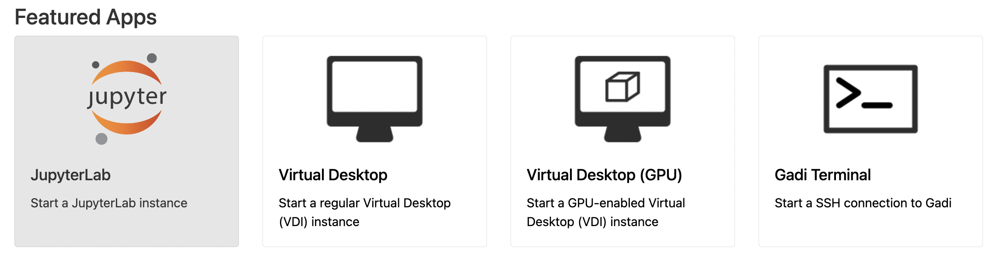
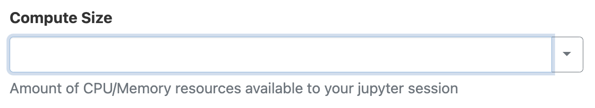
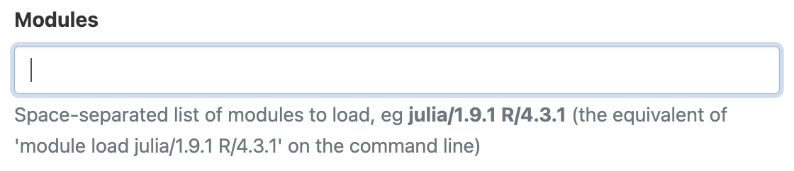
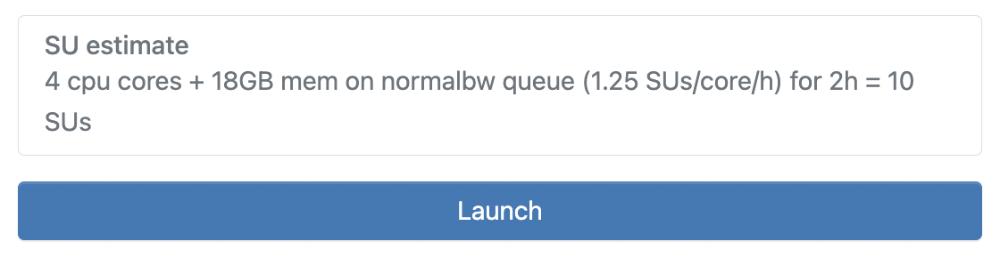

# ACCESS-NRI 2025 CMWG Workshop - ARE JupyterLab setup guide
<p>Quick-start guide to setting up a JupyterLab session using the Australian Research Environment to run the ACCESS-NRI 2025 CMWG Workshop resources.</p>

## Quick-links to sections
- [0. Pre-Workshop preparation](#0-pre-workshop-preparation)
- [1. Open ARE on Gadi](#1-open-are-on-gadi)
- [2. Start JupyterLab App](#2-start-jupyterlab-app)
- [3. Configure JupyterLab session](#3-configure-jupyterlab-session)
- [4. Launch JupyterLab session](#4-launch-jupyterlab-session)

## 0. Pre-workshop preparation

❗*To get the most from the workshop, please complete these "pre-workshop preparation" steps before the workshop*❗

- **NCI Account** - This workshop has been designed to operatre on the Australian Research Environment (ARE), a web-based graphical interface for performing computational research on the National Computational Infrastructure (NCI) *Gadi* supercomputer. In order to access ARE, you will require an NCI account. If you do not have an NCI account, you can sign up [here](https://my.nci.org.au/mancini/signup/0).

- **NCI Project Membership** - To run the tutorials you will require access to two specific projects on *Gadi*:
    - [`nf33` - ACCESS-NRI Training](https://my.nci.org.au/mancini/project/nf33) - This project hosts sample ISSM model files used throughout this workshop.
    - [`xp65` - ACCESS Analysis Environments](https://my.nci.org.au/mancini/project/xp65) - This project hosts the shared `analysis3` conda environment that contains all the Python packages used throughout the workshop.
 
  *Please request to join these projects at least 1-2 days before the workshop to allow for your request to be approved.*

[\[Back to top\]](#access-nri-2025-cmwg-workshop---are-jupyterlab-setup-guide)

## 1. Open ARE on Gadi
Go to the [Australian Research Environment](https://are-auth.nci.org.au/) website and login with your **NCI username and password**. If you don't have an NCI account, you can sign up for one at the [MyNCI website](https://my.nci.org.au).

<p align="center"></p>

[\[Back to top\]](#access-nri-2025-cmwg-workshop---are-jupyterlab-setup-guide)

## 2. Start JupyterLab App
Click on `JupyterLab` under *Featured Apps* to configure a new JupyterLab instance. This option is also available under the *All Apps* section at the bottom of the page and the *Interactive Apps* dropdown located in the top menu.

<p align="center"></p>

[\[Back to top\]](#access-nri-2025-cmwg-workshop---are-jupyterlab-setup-guide)

## 3. Configure JupyterLab session
You will now be presented with the main JupyterLab instance configuration form. Please complete **only** the fields below - leave all other fields blank or to their default values.

- *3.1* **Walltime**: The number of hours the JupyterLab instance will run. For the workshop session, please insert a walltime of `4` hours.

<p align="center"></p>

- *3.2* **Compute Size**: Select `Medium (4 cpus, 18G mem)` from the dropdown menu.

<p align="center"></p>

- *3.3* **Project**: Please enter `nf33`. This will allocate SU usage to the workshop project.

<p align="center"></p>

- *3.4* **Storage**: This is the list of project data storage locations required to complete the pyISSM session exercises. In ARE, storage locations need to be explicitly defined to access these data from within a JupyterLab instance. Please copy and paste the following string in its entirety into the storage input field:
```
gdata/nf33+gdata/xp65
```

<p align="center"></p>

- *3.5* Click `Show advanced settings ...`
  * Optional: You can check the box here to receive an email notification when your JupyterLab instance starts, but as we are running a relatively small instance, it will likely spin up quickly so this probably isn't necessary.</p>

- *3.6* **Module directories**: To load the required environment modules, please copy and paste the following. This is equivalent to using `module use` on the command line.
```
/g/data/xp65/public/modules
```

<p align="center"></p>

- *3.7* **Modules** To load the required `analysis3` conda environment, please copy and paste the following. This is equivalent to using `module load` on the command line.
```
conda/analysis3
```

<p align="center"></p>

- *3.7* Click `Launch` to start your JupyterLab instance.


<p align="center"></p>

[\[Back to top\]](#access-nri-2025-cmwg-workshop---are-jupyterlab-setup-guide)

## 4. Launch JupyterLab session
Once you have clicked `Launch` the browser will redirect to the 'interactive sessions' page where you will see your JupyterLab instance details and current status which will look something like this:

<p align="center"></p>

Once the JupyterLab instance has started (this usually takes around 30 seconds), this status window should update and look something like the following, reporting that the instance has started and the time remaining. More detailed information on the instance can be accessed by clicking the `Session ID` link.

<p align="center"></p>

Click `Open JupyterLab`. This opens the instance in a new browser window where you can navigate to the location of the cloned tutorial files.

[\[Back to top\]](#access-nri-2025-cmwg-workshop---are-jupyterlab-setup-guide)
